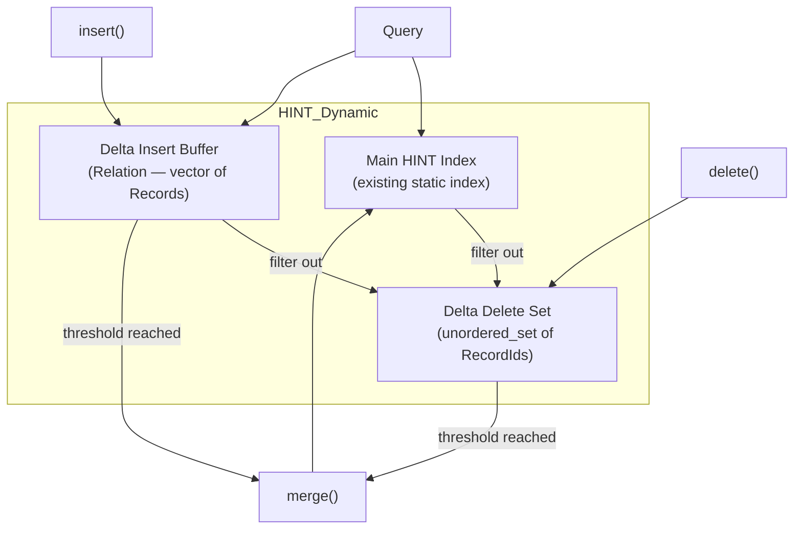

# Delta Index for HINT — Insert/Delete Buffering with Merge

## Problem & Goal

The existing HINT index is **static** — it is built once from a relation and never updated. Rebuilding the entire index for every insert or delete is expensive. We add **delta indexes** — small, cheap buffers for pending inserts and deletes — that are periodically merged into the main HINT index, amortising rebuild cost.

## Design



**Query flow:** Results = [(MainIndex results ∪ DeltaInsert results) − DeltaDelete set](file:///Users/sadeesha/Developer/Uni/Sem_8/hint/main_hint_m.cpp#67-408)

**Merge flow:** When `|deltaInserts| + |deltaDeletes| ≥ threshold`:
1. Build a new [Relation](file:///Users/sadeesha/Developer/Uni/Sem_8/hint/containers/relation.h#135-136) = original records − deletes + inserts
2. Rebuild a fresh [HINT](file:///Users/sadeesha/Developer/Uni/Sem_8/hint/indices/hint.h#54-56) index from the new relation
3. Clear both delta buffers
4. Update domain bounds if needed

## Proposed Changes

### Data Containers

#### [MODIFY] [relation.h](file:///Users/sadeesha/Developer/Uni/Sem_8/hint/containers/relation.h)
Add a `remove(RecordId)` helper to [Relation](file:///Users/sadeesha/Developer/Uni/Sem_8/hint/containers/relation.h#135-136) so the merge logic can easily remove deleted records from the base relation.

---

### Index Core

#### [NEW] [hint_delta.h](file:///Users/sadeesha/Developer/Uni/Sem_8/hint/indices/hint_delta.h)
Declares the `HINT_Dynamic` class:
- **Wraps** the existing [HINT](file:///Users/sadeesha/Developer/Uni/Sem_8/hint/indices/hint.h#54-56) class (composition, not inheritance)
- Members:
  - `HINT *mainIndex` — the static HINT index
  - `Relation baseRelation` — the current "ground truth" relation (needed for rebuild)
  - `Relation deltaInserts` — buffered new records
  - `unordered_set<RecordId> deltaDeletes` — buffered record IDs to delete
  - `unsigned int mergeThreshold` — triggers merge when `|inserts| + |deletes| ≥ threshold`
  - `unsigned int maxBits` — stored for index rebuilds
  - `RecordId nextId` — auto-incrementing ID for new inserts
- Public API:
  - `HINT_Dynamic(Relation &R, unsigned int maxBits, unsigned int mergeThreshold)`
  - `void insert(Timestamp start, Timestamp end)` — add to delta insert buffer
  - `void insert(Record r)` — add to delta insert buffer (with explicit ID)
  - `void remove(RecordId id)` — add to delta delete set
  - `size_t execute_gOverlaps(StabbingQuery Q)` — query main + delta, filter deletes
  - `size_t execute_gOverlaps(RangeQuery Q)` — query main + delta, filter deletes
  - `void merge()` — rebuild main index incorporating both deltas
  - `bool needsMerge()` — check threshold
  - `void getStats()` — stats from main index + delta sizes

#### [NEW] [hint_delta.cpp](file:///Users/sadeesha/Developer/Uni/Sem_8/hint/indices/hint_delta.cpp)
Implements the `HINT_Dynamic` class.

Key implementation details:
- **`insert()`**: Appends to `deltaInserts`, auto-checks `needsMerge()`, triggers `merge()` if threshold reached
- **`remove()`**: Inserts ID into `deltaDeletes` set, auto-checks threshold
- **[execute_gOverlaps(StabbingQuery)](file:///Users/sadeesha/Developer/Uni/Sem_8/hint/indices/hint.cpp#320-375)**: Combines results from `mainIndex->execute_gOverlaps()` and linear scan of `deltaInserts`, filtering both through `deltaDeletes`
- **[execute_gOverlaps(RangeQuery)](file:///Users/sadeesha/Developer/Uni/Sem_8/hint/indices/hint.cpp#320-375)**: Same dual-scan + filter approach
- **`merge()`**: Builds a new [Relation](file:///Users/sadeesha/Developer/Uni/Sem_8/hint/containers/relation.h#135-136) from `baseRelation`, removes deleted IDs, appends inserted records, recomputes domain bounds, rebuilds [HINT](file:///Users/sadeesha/Developer/Uni/Sem_8/hint/indices/hint.h#54-56), clears deltas

> [!IMPORTANT]
> The delta insert buffer is queried by **linear scan** (not indexed), so performance degrades as it grows — this is why the merge threshold matters. The delta delete set uses `unordered_set` for O(1) lookup.

---

### CLI Driver

#### [NEW] [main_hint_delta.cpp](file:///Users/sadeesha/Developer/Uni/Sem_8/hint/main_hint_delta.cpp)
A new CLI driver that:
1. Loads data from file into [Relation](file:///Users/sadeesha/Developer/Uni/Sem_8/hint/containers/relation.h#135-136)
2. Builds `HINT_Dynamic` with configurable merge threshold (`-t` flag)
3. Optionally processes insert/delete commands from a second operations file (`-u` flag): each line is `I start end` (insert) or `D recordId` (delete)
4. Then runs queries from the query file as usual, reporting results and timing

---

### Build System

#### [MODIFY] [makefile](file:///Users/sadeesha/Developer/Uni/Sem_8/hint/makefile)
- Add `indices/hint_delta.cpp` to `SOURCES`
- Add `hint_delta` target that links `hint_delta.o`, `hint.o`, `hierarchicalindex.o`, `relation.o`, `utils.o` with `main_hint_delta.cpp`
- Add `hint_delta` to the `query` meta-target
- Add `query_hint_delta.exec` to `clean` target

---

## Verification Plan

### Build Verification
```bash
cd /Users/sadeesha/Developer/Uni/Sem_8/hint
make clean
make hint_delta
```
Must compile without errors.

### Runtime Correctness Tests

1. **Decompress sample data:**
   ```bash
   cd /Users/sadeesha/Developer/Uni/Sem_8/hint/samples
   gunzip -k AARHUS-BOOKS_2013.dat.gz
   ```

2. **Baseline — run original HINT for reference results:**
   ```bash
   ./query_hint.exec -q gOVERLAPS -v samples/AARHUS-BOOKS_2013.dat samples/AARHUS-BOOKS_2013_20k.qry 2>/dev/null | head -25
   ```

3. **Test HINT_Dynamic with no operations (should match baseline):**
   ```bash
   ./query_hint_delta.exec -q gOVERLAPS -v samples/AARHUS-BOOKS_2013.dat samples/AARHUS-BOOKS_2013_20k.qry 2>/dev/null | head -25
   ```

4. **Test with operations file — create a small test:**
   ```bash
   # Create a test operations file (insert 2 records, delete 1)
   echo "I 100 200" > /tmp/test_ops.txt
   echo "I 150 300" >> /tmp/test_ops.txt
   echo "D 0" >> /tmp/test_ops.txt
   
   ./query_hint_delta.exec -q gOVERLAPS -u /tmp/test_ops.txt -v samples/AARHUS-BOOKS_2013.dat samples/AARHUS-BOOKS_2013_20k.qry 2>/dev/null | head -25
   ```

5. **Test merge trigger — use a small threshold:**
   ```bash
   ./query_hint_delta.exec -q gOVERLAPS -u /tmp/test_ops.txt -e 2 -v samples/AARHUS-BOOKS_2013.dat samples/AARHUS-BOOKS_2013_20k.qry 2>/dev/null | head -25
   ```
   With threshold 2, the 2 inserts should trigger a merge before queries run.
